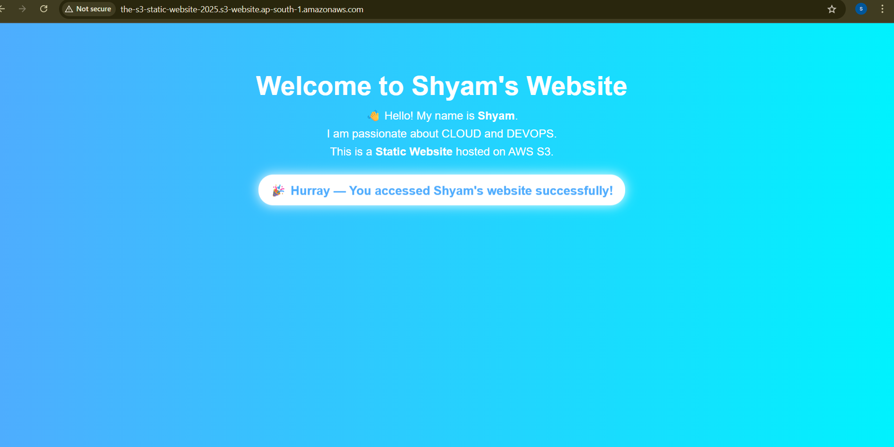
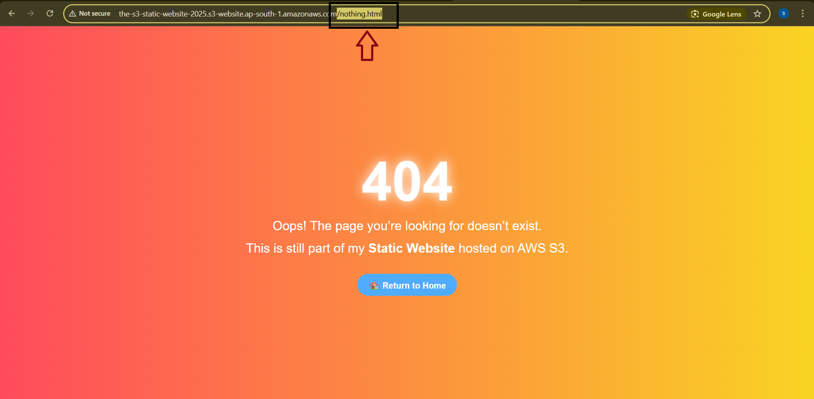

# AWS S3 Static Website Project:

## Project Overview
This is a **static website hosted on AWS S3**, built as a student project to demonstrate AWS cloud skills.  
The website shows an interactive homepage and a custom error page.

## Features
- IAM user creation and permissions
- S3 bucket with static website hosting
- Versioning enabled for files
- Cache-Control headers to serve latest content
- Custom 404 error page
- Interactive homepage with a welcome message

## Screenshots

## Steps Followed
1. Created an IAM user with S3 full access permissions
2. Created an S3 bucket `the-s3-static-website-2025`
3. Enabled static website hosting in S3
4. Uploaded `index.html` and `error.html` with correct Content-Type and Cache-Control 
5. Verified website endpoint and custom error page

## Lessons Learned
- AWS S3 static website hosting basics  
- Managing IAM users and permissions  
- Browser caching and Cache-Control headers  
- Versioning in S3 buckets

